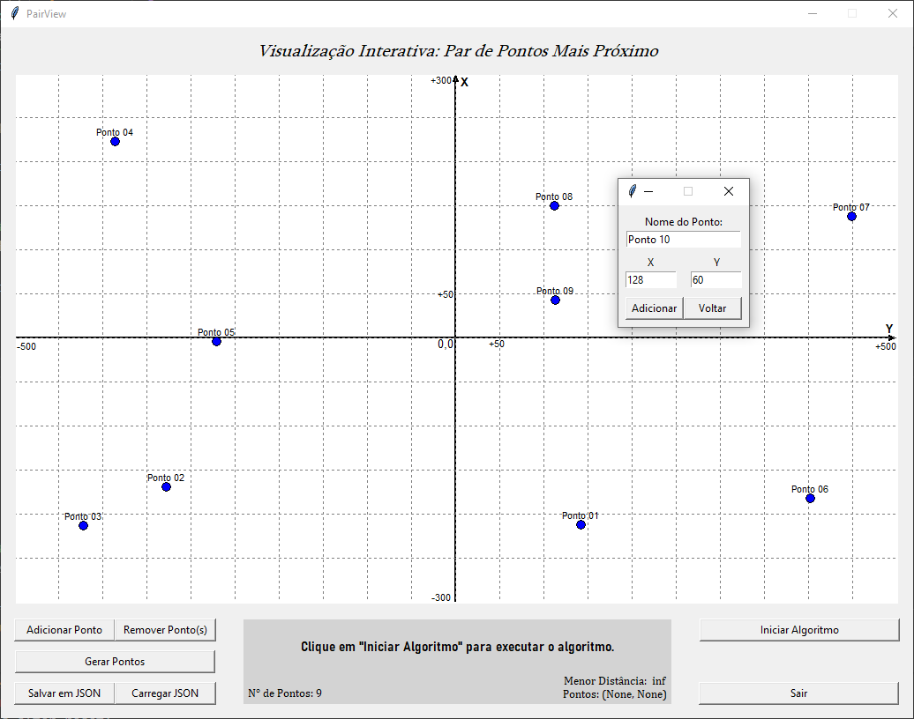
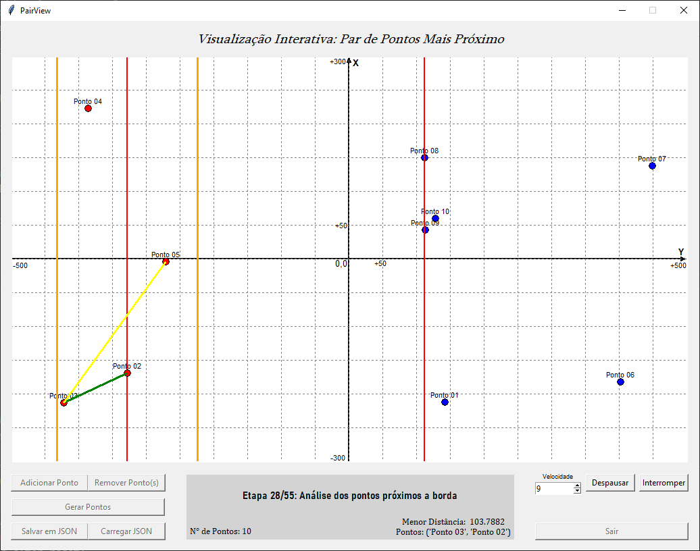
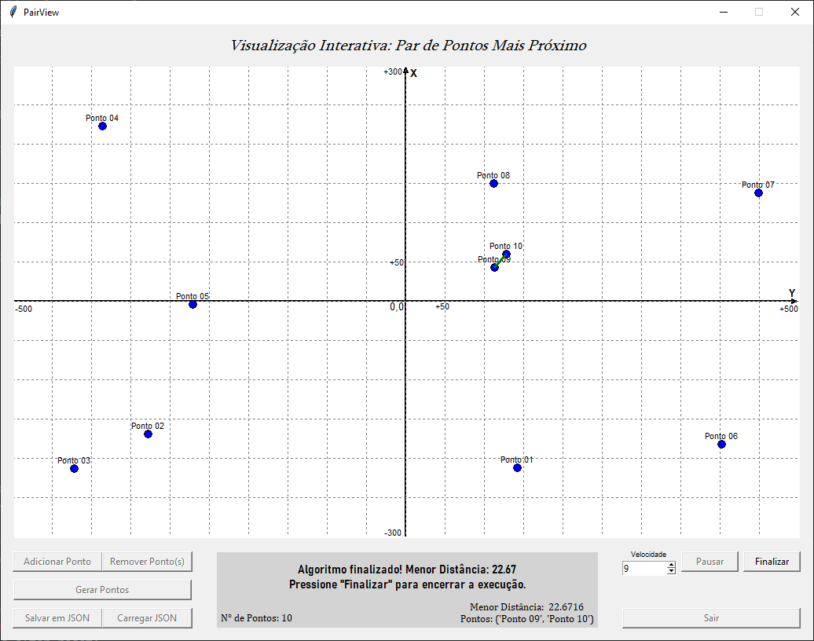

# Dividir e Conquistar (*Dupla 30*): ***PairView***

## Sobre 

O *PairView* é um projeto da disciplina de *Projeto de Algoritmos*, na *Universidade de Brasília/FCTE*, que abrange o conteúdo **Dividir e Conquistar**, que aborda algoritmos baseados na ideia de divisão do conjunto de dados para uma tarefa. Nesse caso, o problema atacado foi a **visualização interativa do algoritmo de par de pontos mais próximos**.

Para isso, foi desenvolvida uma interface interativa para gerenciamento dos pontos, e implementado os algoritmos de **Mediana das Medianas** e **Par de Pontos mais Próximos**, sendo este último de forma visual para acompanhamento de suas etapas. O sistema é dotado de funcionalidades como:

- *Adição, edição e remoção de pontos no plano;*
- *Geração aleatória de pontos;*
- *Customização do tamanho da janela e de elementos da interface;*
- *Implementação visual dos algoritmos (com linhas e pontos coloridos);*
- *Sistema de **pause** e **stop** na execução do algoritmo;*
- *Implementação do algoritmo de **Mediana das Medianas** e do algoritmo de **Par de Pontos mais Próximos**.*

<br>

## Apresentação

Confira a apresentação do projeto pela [**dupla**](#alunos) no link: ***https://youtu.be/v9lwypmHG7U 🔗***

<br>

## Screenshots

Abaixo, estão *screenshots* demonstrando um exemplo do funcionamento do sistema:

### *► Tela Principal + Adição de Ponto*



Essa é a tela principal do sistema, composta por um plano cartesiano e opções relacionadas ao gerenciamento dos pontos e suas coordenadas.

### *► Execução do Algoritmo*



Nessa tela, temos a execução do algoritmo (pausada). Nesse caso, ele está pausado na etapa de análise dos pontos próximos à borda de divisão.

### *► Final da Execução: Menor Distância*



Após completar toda a sua execução, o algoritmo encontra a menor distância entre pontos no plano cartesiano.

<br>

## Requisitos
- **Linguagem**: *Python*
- **Bibliotecas**:
    - *tkinter* (nativa do *Python*)

<br>

## Instalação e Uso

1. Clone o repositório na pasta de sua preferência:

```bash
git clone https://github.com/projeto-de-algoritmos-2025/DeC-D30
```

2. Navegue até a pasta :

```bash
cd DeC-D30
```

3. Execute o arquivo *main.py*:

```bash
python main.py
```

<br>

## Alunos

| [](https://github.com/eduardodpms) | [](https://github.com/pedroeverton217) |
|:-:|:-:|
| [*Eduardo de Pina*](https://github.com/eduardodpms) | [*Pedro Everton*](https://github.com/pedroeverton217) |
| 23/1034494 | 22/1008768 |